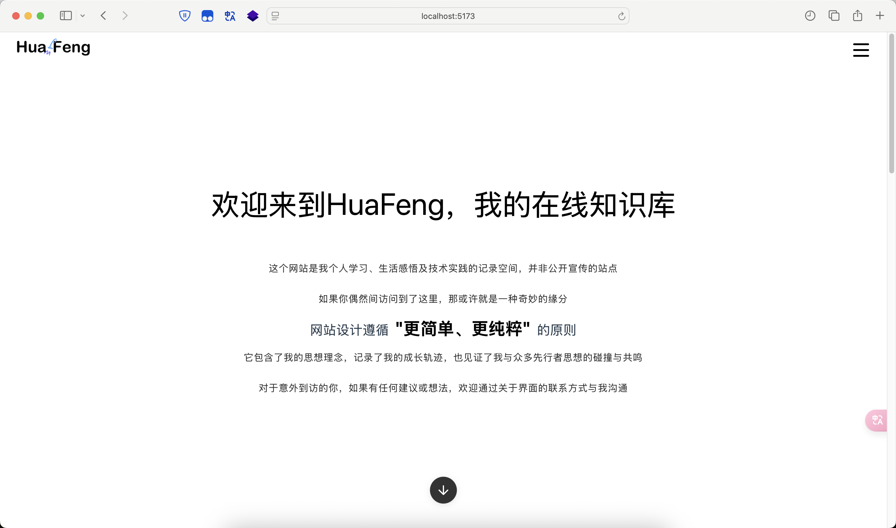
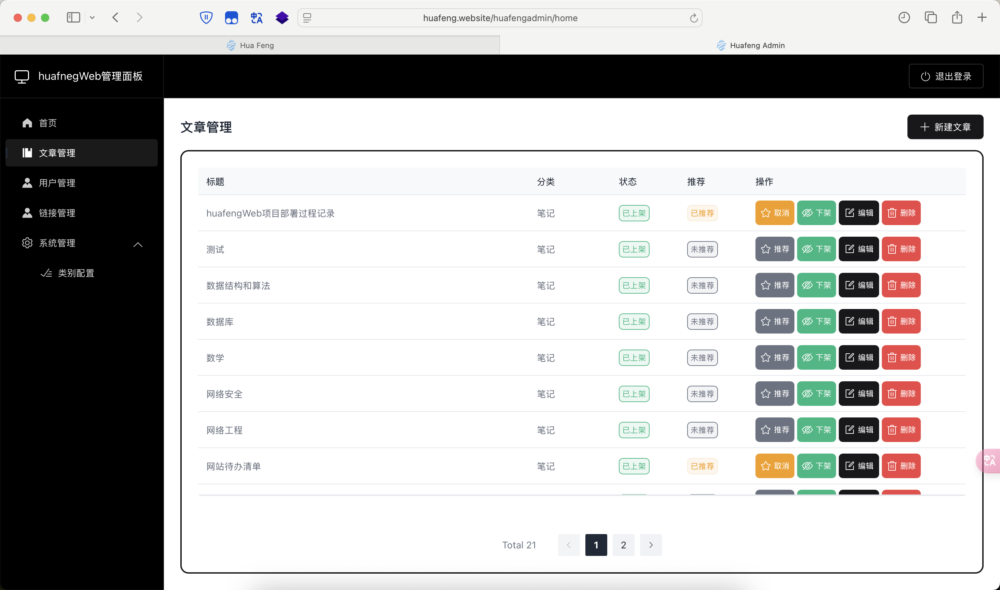

# myWeb-huafeng
开发分支
## 项目介绍
这是一个使用TypeScript编写的、前后端分离的、动态的个人网站  
这个网站是我个人学习、生活感悟及技术实践的记录空间，并非公开宣传的站点    
网站设计遵循 "更简单、更纯粹" 的原则，它包含了我的思想理念，  
记录了我的成长轨迹，也见证了我与众多先行者思想的碰撞与共鸣  
## 项目预览

## 本地预览
 网页：http://localhost:5174/huafeng/  
 管理员面板：http://localhost:5173/admin/  
 后端服务：http://localhost:3000  

## 接口文档
https://apifox.com/apidoc/shared-df03ec93-e775-4686-9baf-a8423402c00b

## 相关技术
- 前端：Vue3 + TypeScript + ElementPlus/GSAP
- 后端：Koa.js + TypeScript + MySQL-TypeORM
- 数据库：MySQL

## 目录结构
clientDir/：客户端
- adminLinterface/：管理员面板
    - assets/：全局样式
    - axios/：axios配置
    - coponent/：组件
    - router/：路由配置
    - stores/：pinia配置
    - views/：视图、页面
    - APP.vue：入口文件
    - custom-type.d.ts && wangeditor-types.d.ts :wangeditor富文本配置

- userInterface/：用户浏览界面
    - 同上

serverDir/：服务端
- src/：
    - controllers/: 业务逻辑
    - migrations/：数据库迁移
    - models/：数据库操作
        - entity/： 数据库模型
    - routes/: 路由
    - utils/: 工具函数
        - validation/：参数校验规则
        - jwt.ts ：jwt配置
        - tokenAuth ：token校验
    - app.ts：入口文件
    - sensitiveData.example.ts ：敏感数据配置
- data-source.ts：数据库配置
